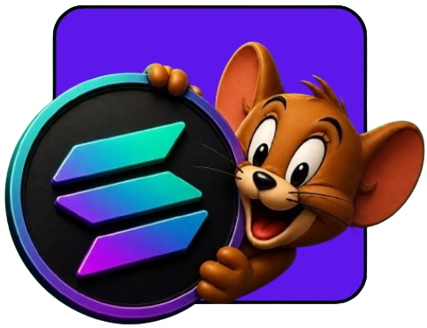

<h1 align="center">earn</h1>

<p align="center">
    
</p>

<p align="center">
    
    
    
</p>

<p align="center">
    trustless escrow. milestone payments. no middlemen.
</p>

---

# Earn — Decentralized Freelance Marketplace on Solana

> Trustless escrow. Milestone payments. No middlemen.

Earn is a Web3 freelance marketplace built on Solana where clients lock funds in an on-chain escrow vault and freelancers get paid instantly upon milestone approval — no banks, no delays, no trust required.

---

## How It Works

The platform connects three layers: the React frontend, a Node.js backend, and a Solana smart contract written in Anchor.

1. **Wallet Auth** — Users connect their Phantom wallet. No passwords, no email. Signing a message proves ownership and creates your identity on the platform.
2. **Post a Job** — Clients create contracts with titles, descriptions, and milestones. Metadata is stored in the backend database. Funds are locked in the on-chain escrow vault simultaneously.
3. **Apply & Get Hired** — Freelancers browse the open marketplace and submit proposals. Proposals are stored in the backend and reviewed by the client.
4. **Submit Work** — Freelancers submit milestone deliverables through the frontend. The backend records the submission and triggers the smart contract to mark the milestone as pending review.
5. **Approve & Get Paid** — The client reviews and approves the work. The smart contract releases the corresponding SOL directly to the freelancer's wallet — instantly.
6. **Dispute & Auto-Release** — If issues arise, either party can trigger a dispute. If the client is inactive past a deadline, an auto-release function ensures the freelancer is paid.
7. **Cancellation** — Contracts can be cancelled at any stage. Refunds are processed securely through the smart contract.

The backend manages data and application logic. The smart contract handles funds and trust. Together they create a reliable, decentralized workflow.

---

## Tech Stack

| Layer | Technology |
|---|---|
| Frontend | React, TypeScript, Vite, Tailwind CSS, Framer Motion |
| Blockchain | Solana, Anchor Framework |
| Wallet | Phantom, @solana/wallet-adapter-react, @solana/web3.js |
| Backend | Node.js, Express |
| Database | PostgreSQL (NeonDB) |
| Auth | JWT + Wallet message signing |

---

## Features

- **Trustless Escrow** — Funds locked in an on-chain vault. Released only on milestone approval.
- **Milestone Payments** — Break work into milestones. Each approval triggers an automatic SOL transfer.
- **Open Marketplace** — Post jobs, submit proposals, build your on-chain reputation.
- **Wallet Auth** — No passwords. Sign a message with Phantom. That's it.
- **Instant Payouts** — Work approved? SOL hits your wallet in seconds.
- **Dispute Resolution** — On-chain arbitration for contested milestones.
- **Auto-Release** — Inactive client? Funds release automatically after the deadline.

---

## Architecture

```
Frontend (React)
     │
     ├── Wallet Connect (Phantom)
     │
     ├── POST /jobs → Backend (Express)
     │        └── Save metadata → PostgreSQL
     │
     └── Lock funds → Solana Program (Anchor)
                          ├── Escrow vault
                          ├── Milestone approval → SOL transfer
                          ├── Dispute trigger
                          └── Auto-release / Cancellation
```

---

## Getting Started

### Prerequisites

- Node.js 18+
- Rust + Solana CLI
- Anchor CLI
- Phantom Wallet (browser extension)

### Installation

```bash
# Clone the repo
git clone https://github.com/yourusername/earn
cd earn

# Install frontend dependencies
cd frontend
npm install

# Install backend dependencies
cd ../backend
npm install

# Install Anchor program dependencies
cd ../program
anchor build
```

### Environment Variables

Create a `.env` file in the backend directory:

```env
DATABASE_URL=your_neondb_connection_string
JWT_SECRET=your_jwt_secret
SOLANA_RPC_URL=https://api.devnet.solana.com
PROGRAM_ID=your_anchor_program_id
```

### Run Locally

```bash
# Start backend
cd backend
npm run dev

# Start frontend
cd frontend
npm run dev

# Deploy program to devnet
cd program
anchor deploy
```

---

## Smart Contract

The escrow program is written in Anchor and handles:

- Locking funds on contract creation
- Releasing SOL per milestone on client approval
- Dispute initiation and resolution
- Auto-release after inactivity deadline
- Full refund on cancellation

Program is currently deployed on **Solana Devnet**.

---

## Roadmap

- [ ] Mainnet deployment
- [ ] On-chain reputation scores
- [ ] Multi-token support (USDC)
- [ ] Mobile-friendly UI
- [ ] On-chain arbitration DAO

---

## Built By

**Arijit** — solo founder, Kolkata, India.  
Student. Building things that handle real money and real stakes.

---

## License

MIT
